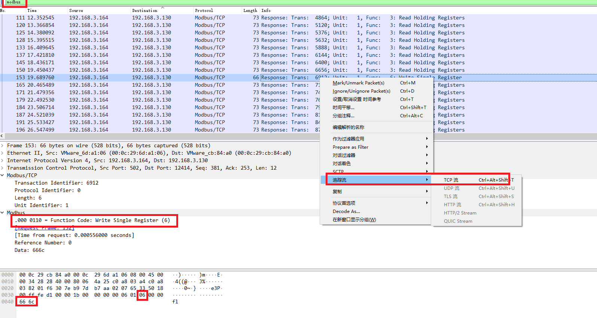
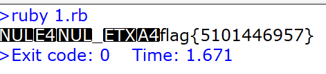

# modbus writeup

根据题目名称提示和协议解析，信息应该隐藏在物联网协议modbus中

解析该协议报文，发现TCP流中通过WriteSingleRegister消息暴露了信息

对于WriteSingleRegister消息，倒数第五字节决定了消息类型

最后两字节是载荷

---



---

解码数据包运行得出结果

```ruby
$LOAD_PATH << '.'
require 'packit/lib/packet_handler'
require 'packit/lib/pdu_resolution'

code = []

l2l3 = lambda do|data|
  l2 = PacketHandler.EthernetII(data[0..13])
  l3 = PacketHandler.IPv4(data[14..-1])
  code << data[-2..-1].map{|f|f.chr}.join if data[-5].to_i & 0x7f == 0x06 # Writer Single Register(0x6)
  l2.merge(l3)
end

p2p3 = lambda do|data|
  {
    no: data['no'],
    time: data['time'],
    length: data['length'],
    dst_mac: data['dest_mac'], # caution name!
    src_mac: data['src_mac'],
    dst_ip: data['dst_ip'],
    src_ip: data['src_ip']
  } if data['length'].size==66 # Writer Single Register(0x6)
end

数据包解析器::解析文档("modbus.pcap","abstract",resolution: l2l3,filter: p2p3)

puts code.uniq.join
```

---

结果


